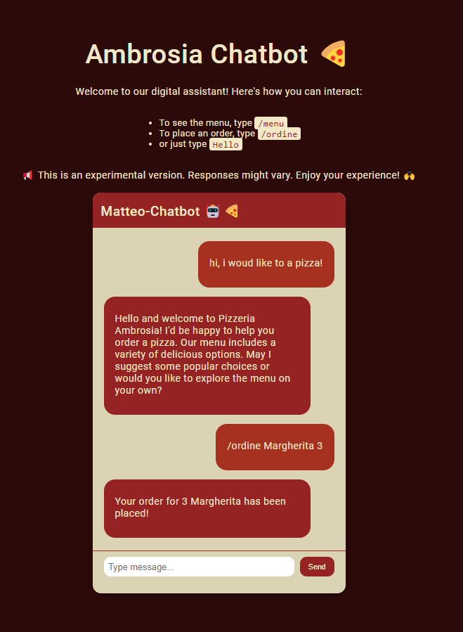
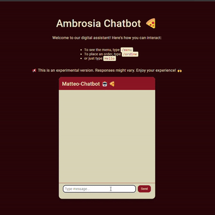

# 🍕 Pizzeria Chatbot 🤖

Welcome to the most delicious chatbot on the planet! 🌍 Our Pizzeria Chatbot is here to take your orders, answer your pizza-related questions, and sprinkle some humor on your day. 🎉




## 🚀 Getting Started

```markdown
1. **Clone the Repo** 📂:
   ```bash
   git clone https://github.com/CarmineMattia/Pizzeria-Chatbot.git
   ```

2. **Navigate to the Project Directory** 🚶:
   ```bash
   cd chatbot-pizza
   ```

3. **Install Dependencies** 📦:
   ```bash
   npm install
   ```

## 🛠 Configuration

### 1. OpenAI API Key 🗝️

In order to chat with our pizza-loving bot, you'll need to get an API key from OpenAI. Once you have it:

📝 Edit the `.env` file and add:
```
OPENAI_API_KEY=your_openai_key_here
```

### 2. Database Setup 🗄️

Our chatbot loves to remember your favorite pizzas! 🍕❤️ To set up the database:

📝 Edit the `.env` file with the following database configurations:
```
DB_CONNECTION=mysql
DB_HOST=127.0.0.1
DB_PORT=3307
DB_DATABASE=pizzeria_chatbot
DB_USERNAME=root
DB_PASSWORD=12345
```

🔧 Run the provided SQL scripts to set up the database structure and initial data.

## 🚧 Coming Soon: Docker Support 🐳

I'm working on adding Docker support to make the setup even easier! Stay tuned and keep those pizza ovens hot! 🔥

## 🤔 Need Help?

If you run into any issues, just remember: In pizza we crust! 🍕 But also, feel free to open an issue or reach out for support.

## 🎉 Enjoy!

Now, go ahead and chat with the bot, order some virtual pizzas, and have fun! And remember, calories in virtual pizzas don't count! 😉🍕
```
